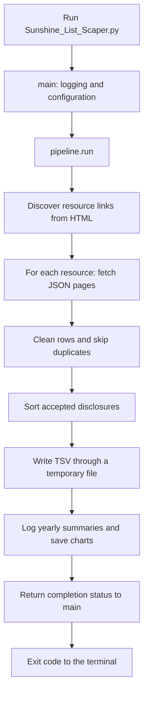

# 1. Application flow

## The purpose and the boundaries

The application discovers Ontario Sunshine List resource links, downloads the
records through CKAN, normalizes usable disclosures, skips duplicates, and produces
an export plus reports. A row represents a salary disclosure. It is not a reliable
unique identity for a person: the same person can appear across years, and names can
be shared by different people.

The program attempts all discovered resources. "Completed" describes the run's
request/chart status; it does not prove that discovery found every published dataset
or that every raw row passed validation. Inspect the logs for rejected rows.

## What a user sees

Run `python Sunshine_List_Scaper.py` from the repository root. By default:

- Progress, warnings, yearly summaries, and failures appear through logging.
- `output.txt` is a tab-separated file: Name, Salary, Job Title, Employer, Year, UUID.
- Records are sorted by salary, highest first.
- `chart_yearly.png` compares accepted-record counts and average salary by year.
- `chart_titles.png` shows the ten most frequent nonempty job titles.

The logs call counts "people" and the yearly chart says "Headcount." Technically
they count accepted disclosure records, not people deduplicated across all years.
The averages cover accepted Sunshine List disclosures, not all Ontario workers.

The default logging level is INFO. Setting WARNING hides ordinary progress and
yearly INFO summaries. Logging normally goes to standard error; TSV and chart data
go to files. A chart opens no interactive window because the program saves images.

In PowerShell, `$LASTEXITCODE` after the program ends reports:

| Code | Meaning |
| --- | --- |
| 0 | No dataset fetch failures and no caught chart-generation failure |
| 1 | Failure, or usable outputs from an incomplete run |
| 130 | The user interrupted execution with Ctrl+C |

If every accepted record has a missing title, the title chart is skipped and a
warning is logged; that alone does not make the exit code 1. An earlier title chart
may remain. Check the logs and timestamps rather than assuming every visible image
was generated in this run.

## Read the code in execution order

The database practice module is absent from this diagram because the pipeline does
not import or call it. There is no frontend or API server in the scraper yet.

## File responsibilities

| File | Responsibility | Important boundary |
| --- | --- | --- |
| [Sunshine_List_Scaper.py](../Sunshine_List_Scaper.py) | Command-line startup and exit status | Does not implement downloading or cleaning |
| [config.py](../config.py) | User-editable settings | Contains settings, not shared implementation imports |
| [client.py](../sunshine_scraper/client.py) | HTTP, HTML discovery, JSON validation, pagination | Does not write reports |
| [processing.py](../sunshine_scraper/processing.py) | Normalize and validate rows; update accepted data | Does not make HTTP requests |
| [pipeline.py](../sunshine_scraper/pipeline.py) | Coordinate steps and decide completion status | Keeps the order of operations in one place |
| [export.py](../sunshine_scraper/export.py) | Safely write TSV | Does not know how a row was downloaded |
| [reporting.py](../sunshine_scraper/reporting.py) | Summaries and charts | Receives already accepted records |
| [errors.py](../sunshine_scraper/errors.py) | Define the shared `ScraperError` exception | Supplies an error type, not an error handler |
| [database.py](../sunshine_scraper/database.py) | Standalone read-only SQL practice | Requires an existing database; not a storage integration |
| [__init__.py](../sunshine_scraper/__init__.py) | Identify/document the Python package | Does not run the scraper |
| [requirements.txt](../requirements.txt) | List third-party dependencies | Requests, BeautifulSoup, and Matplotlib |
| [tests/test_error_handling.py](../tests/test_error_handling.py) | Existing offline behaviour checks | HTTP and retry waits are mocked |
| [tests/test_database.py](../tests/test_database.py) | Check query-module cleanup | Uses temporary SQLite databases |

## Function-by-function call map

### Startup: `main()`

The script's `if __name__ == '__main__'` guard runs `main()` only on direct execution.
`raise SystemExit(main())` sends its returned number to the terminal.

`main()` creates the logging setup, applies `config.log_level`, and sets stdout to
UTF-8 if that stream supports `reconfigure`. It passes paths and request settings to
`pipeline.run()`. It maps True to 0 and False to 1. Expected scraper/file exceptions
get a concise error message; Ctrl+C returns 130; an unexpected exception is logged
with its traceback and returns 1. This final catch keeps debugging information.

### Coordination: `run()`

`run()` makes a dictionary of request options and calls `discover_resource_links()`.
It creates four collections for this run:

| Name | Type | Contents |
| --- | --- | --- |
| `names_list` | list | Accepted record dictionaries |
| `yearly_salary_dict` | dictionary | Year strings mapped to salary lists |
| `seen_records` | set | Normalized duplicate-key tuples |
| `failed_resources` | list | Dataset IDs whose download failed |

For each link, it removes query strings/trailing slashes while extracting the final
path segment as the resource ID. It calls `fetch_all_records()` and then
`process_records()`. A `ScraperError` during a dataset fetch is logged and that
dataset is skipped; remaining datasets are still attempted.

If no usable records remain, it raises `ScraperError` before export. Otherwise it
sorts `names_list` in place using `salary_for_sorting()`, exports it, logs summaries,
and creates charts. Fetch failures or caught chart errors produce False.

### HTTP boundary: `request_page()`

This function validates timeout/retry/backoff settings, then calls `requests.get()`.
A response with HTTP 200 is returned to its caller. Connection errors, timeouts, and
the selected temporary HTTP statuses can retry. Other request errors and permanent
statuses stop. Retries wait for `backoff * 2 ** attempt` seconds, with a bounded
number of attempts. The timeout is for connection/read waiting, not the entire run.

Every HTML or API request uses this same policy. See chapter 3 for exact status codes.

### Discovery: `discover_resource_links()`

It gets the landing page through `request_page()`. BeautifulSoup parses the HTML;
the function looks at `<a>` elements with `href` attributes. It keeps links whose
lowercase URL contains both `public-sector-salary-disclosure` and `resource`.
It deduplicates by extracted resource ID, preserving first-seen order. No matching
links is a `ScraperError`.

This is a URL-text filter, not proof that every matched link is a valid dataset or
that discovery is exhaustive. The stored href can be relative because only its path
is needed to identify the dataset; records are fetched from the configured API URL.

### Download: `fetch_all_records()`

It builds query parameters `resource_id`, `limit`, and `offset`, requests a page,
and calls `response.json()`. It requires an object with `success` exactly True and
`result.records` as a list. It rejects oversized pages and consecutive repeated full
pages. It appends each batch and advances the offset until a short page is returned.

It returns a list for one complete resource. If a later page fails, it raises with
the resource ID and offset; the earlier pages are not returned as a completed dataset.
The repeated-page guard covers consecutive identical full pages, not every possible
server pagination bug.

### Cleaning: `normalize_text()` and `clean_record()`

`normalize_text()` turns missing values into an empty string, rejects containers and
booleans, converts allowed scalar values to text, replaces non-breaking spaces, and
collapses whitespace using `split()` followed by `' '.join(...)`.

`clean_record()` requires a dictionary row with usable first name, last name,
employer, year, and salary. It tries supported year-column aliases in order and
requires a four-digit ASCII year string. It uses `Salary Paid`, falling back to
`Salary` only if the former is None. It removes dollar signs/commas, converts to
float, and rejects negative or non-finite numbers. Job title is optional.

It returns two values: the cleaned display record and its duplicate-key tuple.
Chapter 2 shows both exactly. Raw fields outside the six exported columns are not
preserved by this transformation; a database will not magically recover them.

### Acceptance: `process_records()`

For each raw row, it calls `clean_record()`. Value/type/overflow errors reject only
that row. The function then checks the key against `seen_records`. A duplicate is
skipped. A new record updates all three accepted-data collections together, then
increments counts. Invalid reasons, duplicates, and missing titles are logged.
It returns valid/invalid counts; the current pipeline does not use those return values.

### Sorting: `salary_for_sorting()`

It returns `person['Salary']`. `names_list.sort(key=salary_for_sorting, reverse=True)`
uses that number for comparisons, ordering highest first. Python supplies the sorting
algorithm; the helper simply names the value being compared.

### Export: `write_records()`

It creates a temporary file in the destination directory and uses `csv.DictWriter`
with a tab delimiter, fixed columns, UTF-8, and a header. The CSV library handles
quoting correctly. Closing the temporary file before replacement supports Windows.

Only after writing all rows does `os.replace()` publish the file at the final path.
If writing/replacement fails, the previous destination is not deliberately truncated,
and `finally` removes the temporary file if it remains. This is protection for one
TSV publication; it does not make the TSV and both chart files one transaction.

### Reporting: `print_yearly_summary()` and `create_charts()`

Despite its historical name, `print_yearly_summary()` uses INFO logging. It visits
years newest first and calculates `sum(salaries) / len(salaries)`.

`create_charts()` sorts years oldest first so labels, counts, and averages line up.
It creates bars for disclosure counts and a second axis with average-salary points.
Its nested `format_salary_tick(value, position)` callback produces labels like
`$125,000`; Matplotlib supplies the unused tick position argument.

For titles, `Counter` counts nonempty titles, `most_common(10)` chooses ten, and
reversing them places the largest horizontal bar at the top. Each figure is closed
in a `finally` block around saving. No titles means warning/skip rather than trying
to unpack an empty list. Saving PNGs is separate from the protected TSV export.

### Database practice: `get_top_salaries()` and `main()`

`get_top_salaries(database_path, year=2024, limit=10)` opens an existing SQLite file
read-only, binds year/limit as SQL values, fetches tuples, and closes the connection
even if querying fails. Its `main()` logs errors and returns an exit code; it runs
only with `python -m sunshine_scraper.database`. It neither defines a schema nor
inserts rows. These names are local to their module, separate from the scraper CLI.

## Failure boundaries worth understanding

| Problem | What happens |
| --- | --- |
| Landing page fails or contains no matching links | Stop before exporting |
| One resource fails, others work | Skip failed resource, export accepted data, exit 1 |
| Later page of a resource fails | Discard that resource's collected pages |
| One malformed/duplicate raw row | Skip row; continue other rows |
| No accepted rows across the run | Keep existing outputs; exit 1 |
| TSV publication fails | Raise to CLI; attempt temporary-file cleanup |
| Chart save fails after export | Keep TSV; log incomplete run; exit 1 |
| No nonempty titles | Skip title chart and warn; previous title chart can remain |
| Unexpected programming error | Log traceback at CLI; exit 1 |

Failures during startup imports occur before `main()` can catch them. Install the
requirements first. Output protection also depends on the filesystem succeeding at
cleanup; no error handler can guarantee success if the disk refuses operations.
